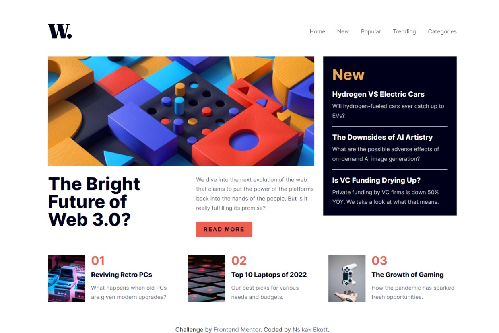
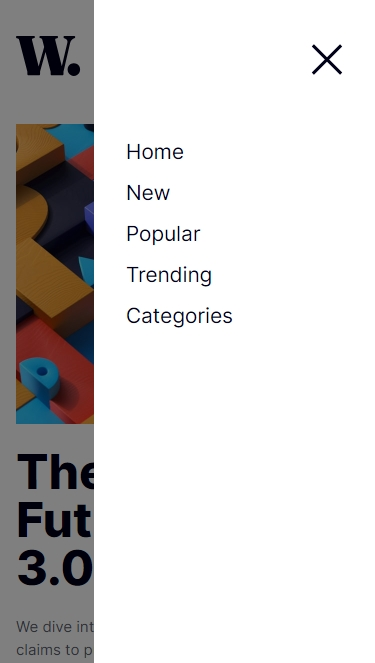

# Frontend Mentor - News homepage solution

This is a solution to the [News homepage challenge on Frontend Mentor](https://www.frontendmentor.io/challenges/news-homepage-H6SWTa1MFl). Frontend Mentor challenges help you improve your coding skills by building realistic projects.

## Table of contents

- [Overview](#overview)
  - [The challenge](#the-challenge)
  - [Screenshot](#screenshot)
  - [Links](#links)
- [My process](#my-process)
  - [Built with](#built-with)
  - [What I learned](#what-i-learned)
  - [Continued development](#continued-development)
  - [Useful resources](#useful-resources)
- [Author](#author)
- [Acknowledgments](#acknowledgments)

## Overview

### The challenge

Users should be able to:

- View the optimal layout for the interface depending on their device's screen size
- See hover and focus states for all interactive elements on the page

### Screenshot

## Desktop



## Mobile


## Mobile Menu



### Links

- [Solution URL](https://github.com/Ekott2006/frontend-mentor-news-homepage)
- [Live Site URL](https://your-live-site-url.com)

## My process

### Built with

- Semantic HTML5 markup
- CSS custom properties
- Flexbox
- CSS Grid
- Mobile-first workflow

### What I learned

Using `picture` to add responsive images based on the size of the screen

```html
<picture class="hero__img">
  <source
    media="(max-width: 375px)"
    srcset="./assets/images/image-web-3-mobile.jpg"
  />
  
</picture>
```

Learning how to and the use case of `visibility`

```css
.header__nav-show {
    visibility: visible;
    right: 0;
  }
```

### Continued development

- [Responsive Images](https://developer.mozilla.org/en-US/docs/Learn/HTML/Multimedia_and_embedding/Responsive_images)
- Transition and Animations

### Useful resources

- [Variable Fonts](https://css-tricks.com/newsletter/259-how-to-use-variable-fonts/) - This helped to use Variable Fonts in the Project. I'd recommend it to anyone still learning this concept.
- [Animating Mobile Menu](https://blog.logrocket.com/animating-mobile-menus-using-css/) - This is an amazing article which helped me finally understand how to animate mobile menu. I'd recommend it to anyone still learning this concept.

## Author

- Website - [Nsikak Ekott](https://portfolio-site-sage-three.vercel.app/)
- Frontend Mentor - [@Ekott2006](https://www.frontendmentor.io/profile/Ekott2006)

## Acknowledgments

[Claude AI](https://claude.ai) for the mobile menu
